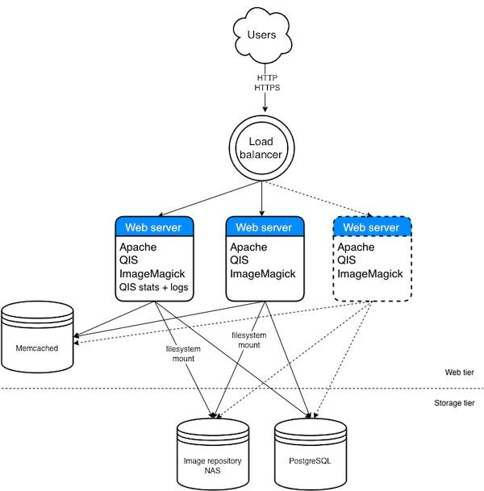

# Running QIS

* [On your own server](#diy)
* [On Amazon Web Services (AWS)](#aws)
* [On Docker](#docker)
* [Architecture for high availability or high loads](#architecture)

## Manual installation

If you have your own server, and the thought of installing lot of operating
system packages makes you happy, you can install QIS and its components manually
by following the [installation guide](install.md).

## Running on Amazon Web Services (EC2)

Quru provides an Amazon Machine Image (AMI) that can be used to run a pre-installed
copy of QIS on Amazon's EC2 service. The current AMI is `ami-044f56e3f927a8f22`
in the EU West (Ireland) region.

### Instructions - AWS

* Register if you need to and log into AWS at https://aws.amazon.com/
* Go to the EC2 service
* At the top of the screen, select the _EU West (Ireland)_ region
* Choose Create Instance / Launch Instance
* At _Step 1: Choose an AMI_ click the _Community AMIs_ filter and search for
  `qis` or the exact AMI number as shown above
* The QIS AMI should be shown, click Select
* At _Step 2: Choose an Instance Type_ choose:
  * `t2.micro` if you just want a lightweight image server or a quick trial
  * `t2.medium` for a very capable image server
    (the AMI is pre-configured for this size - 2 CPU, 4GB RAM)
  * Something larger if you're getting serious (increase the cache size and number
    of workers after launch, see below)
* At _Step 3: Configure Instance Details_ the defaults will work but can be customised
* At _Step 4: Add Storage_ allow enough disk space for your image library
* At _Step 5: Add Tags_ a name tag can be useful but is not required
* At _Step 6: Configure Security Group_ create or select a security group that allows:
  * SSH TCP port 22 (optionally restrict the source to your own IP address)
  * HTTP TCP port 80 from anywhere
  * HTTPS TCP port 443 from anywhere
* Click Review and Launch, then (if OK), Launch

The server will take a minute or so to be created.

* Go to _Instances_ on the EC2 menu
* Select the QIS server
* When the instance state is _running_ (green icon) look for its _Public IP_
  e.g. `34.245.143.41`, copy the value, and paste it into the address bar in
  your web browser
* When the "Quru Image Server" web page has loaded, click Sign In
* Your web browser will show a security warning because the pre-installed HTTPS
  certificate is only a testing/dummy certificate, but in this particular case
  it is safe to ignore the warning and continue
* Log into QIS with username `admin` and password `qisadmin`
* Click Administrator in the top menu, then Edit Account
* Enter a new password into the Password and Confirm Password boxes,
  then click Apply to set the new password for the `admin` user
* You can now browse the sample images and explore the admin console
* You might want to [review the management functions](overview.md#repository),
  [set up access permissions](overview.md#access), or just try requesting some
  images directly:
  * `https://<IP ADDRESS>/image?src=/samples/penguin.jpg&width=400`
  * `https://<IP ADDRESS>/image?src=/samples/penguin.jpg&width=400&left=0.2&top=0.3&right=0.8&bottom=0.8`

### Completing the deployment

If you want to use the server in production, a number of additional steps are
required to complete the setup. These require the use of the command line interface
and knowledge of how to change configuration files on a Linux server, so it would
be nice to automate all of this one day.

#### Assign a public host name

To reach the server on a proper host name instead of its IP address, you need to
create a public DNS entry for the server. You can use Amazon's Route 53 service
to do this or the DNS service associated with your own domain name. If using your
own DNS you need to give the server a static IP address that doesn't change.
In AWS, go to _Elastic IPs_ on the EC2 menu, create a new elastic IP address and
assign it to the QIS server. Finally create a DNS entry that links your server's
public host name to its IP address.

With the public DNS in place, log into the server:

    $ ssh -i <your-ec2-key-file> ubuntu@<public-ip-address>

Set the host name (here `images.example.com`) in the web server and QIS.  
Edit `/etc/apache2/sites-enabled/qis.conf` and set the `ServerName` value:

    ServerName images.example.com

Edit `/etc/apache2/sites-enabled/qis_ssl.conf` and set the `ServerName` value:

    ServerName images.example.com

Edit `/opt/qis/conf/local_settings.py` and set the `PUBLIC_HOST_NAME` value:

    PUBLIC_HOST_NAME="images.example.com"

Finally restart the web server:

    $ sudo systemctl restart apache2

And check that your image server is now reachable on its public host name, 
e.g. `http://images.example.com/`.

#### Install a proper TLS / HTTPS certificate

Once your public host name is set up, to serve images over HTTPS and access the
admin console without a security warning a proper TLS certificate needs to be
installed. You can obtain a free and automatically renewing TLS certificate by
[installing the Certbot package](https://certbot.eff.org/lets-encrypt/ubuntubionic-apache).

Or if you have your own TLS certificate you will need to copy it onto the server
into:

    /etc/ssl/certs/      (the cert or pem files) and
    /etc/ssl/private/    (the key file)

Then edit `/etc/apache2/sites-enabled/qis_ssl.conf` and set:

    SSLCertificateFile      /etc/ssl/certs/<YOUR CERT FILE>
    SSLCertificateKeyFile   /etc/ssl/private/<YOUR KEY FILE>

Finally check that the new configuration is OK and if so restart the web server:

    $ sudo apache2ctl configtest
    Syntax OK
    $ sudo systemctl restart apache2

Your image server should now be reachable on HTTPS without security warnings
(showing a green padlock in the web browser), e.g. `https://images.example.com/`.

#### Setting the in-memory cache size

If you did not deploy a `t2.medium` instance (or a server with 4GB of memory)
then you will need to adjust the memory limit of the Memcached service up or down.

The Memcached limit needs to be set to a value so that when Memcached is full the
server is not using swap space and still has enough spare memory to run everything
else (Apache, Postgres, QIS image processing, and the operating system when all
are on a single server). This is some value that is always less than the server's
total memory.

The default Memcached limit in the AMI is 2GB. To change it, edit the file
`/etc/memcached.conf` and change the line:

    -m <NEW VALUE IN MB>

Then restart the Memcached service:

    $ sudo systemctl restart memcached

#### Setting the number of worker processes

If you did not deploy a `t2.medium` instance (or a server with 2 CPUs)
then you might want to adjust the number of QIS worker processes up or down.

Each worker process can handle up to 15 simultaneous image requests. This is how
many images can be generated at once, it is not a limit on the number of users
that can use your web site, which is much much higher. Once an image has been
fetched or generated it is passed over to Apache to serve to the user and the
worker process becomes free again.

If there are too few workers the server may be under-utilised, too many and the
server may become overloaded. A guideline is to use 1 worker process per server
CPU core, minus a couple if Postgres and Memcached are on the same server, but
no lower than 2.

QIS has separate settings for HTTP and HTTPS traffic, but it is expected that
most images will be served via just one of these. The default number of workers
in the AMI is 2. To change this, edit `/etc/apache2/sites-enabled/qis.conf`
for HTTP and `/etc/apache2/sites-enabled/qis_ssl.conf` for HTTPS, and change the
line:

    WSGIDaemonProcess ... processes=<NEW NUMBER> ...

Check that the new configuration is OK and if so restart the web server:

    $ sudo apache2ctl configtest
    Syntax OK
    $ sudo systemctl restart apache2

#### Setting up QIS

Aside from the public host name already set above, only one setting needs to be
changed initially, which is a "secret key" value to use for securing login
sessions. You can generate a new secret key by running:

    $ pwgen -s 32 1
    vTSMt2JZqQB8QKmPUhQy4SNm3wA8OWD3

Edit the QIS local settings file `/opt/qis/conf/local_settings.py` and set:

    SECRET_KEY="vTSMt2JZqQB8QKmPUhQy4SNm3wA8OWD3"

using your own value in place of this example.

If QIS is being deployed across multiple servers with a load balancer, set the
same value for SECRET_KEY on all servers, so that the same login session will
work across all of the servers.

For the full list of available settings, see the file `/opt/qis/src/imageserver/conf/base_settings.py`.
Do not edit `base_settings.py` directly because this file will be overwritten if
you upgrade QIS. To change a setting, copy it into `local_settings.py` and set
the new value there.

After changing the settings restart the web server:

    $ sudo systemctl restart apache2

#### Advanced setup

For more advanced setup and tuning information, see the [install guide](install.md)
and the [tuning guide](tuning.md).

## Running in Docker

Quru provides 3 Docker images and a `docker-compose` script that will set up and
run everything for you on a single host. Persistent files (your images, the QIS
database, and log files) are stored in a permanent directory on the host. Running
QIS in a multi-host environment with Kubernetes or Docker Swarm is beyond the
scope of this guide.

### Instructions - Docker

Note: When using Docker for Linux, you will likely need to prefix the `docker`
and `docker-compose` commands below with `sudo`. When using Docker for Mac
or Docker for Windows this is not necessary.

* Firstly install Docker and `docker-compose`, and get to be familiar with how
  images run as containers, how docker-compose scripts work, and how volumes can
  be mounted inside containers
* On your Docker host, shut down any web servers or services that are already
  running on ports 80 or 443
* On your Docker host, create a directory to contain the docker-compose files
  and the permanent QIS data:

    $ mkdir -p qis/data
    $ cd qis
    $ wget https://raw.githubusercontent.com/quru/qis/master/deploy/docker/docker-compose.yml
    ...
    $ ls -l
    total 8
    drwxr-xr-x  2 matt  users    64 27 Mar 11:26 data
    -rw-r--r--  1 matt  users  1452 27 Mar 11:26 docker-compose.yml

* In the same directory, create a new file `.env` with contents:

    QIS_HOSTNAME=images.example.com
    QIS_DATA_DIR=./data

* Set the value of `QIS_HOSTNAME` above to the host name of your Docker host
* Thanks to docker-compose [issue #3513](https://github.com/docker/compose/issues/3513)
  the `build` lines in the docker-compose file need to be removed. You can do this
  quickly by running:

    $ sed -i '/build:/d' docker-compose.yml       (on Linux)
    or
    $ sed -i '' '/build:/d' docker-compose.yml    (on Mac)

* You can then download the QIS Docker images from [Docker Hub](https://cloud.docker.com/u/quru/):

    $ $ docker-compose pull
    Pulling qis_db    ... done
    Pulling qis_cache ... done
    Pulling qis_as    ... done

* Optional - if you would rather build the images yourself than download them,
  you can do so by using the Dockerfiles from the sub-folders at
  https://github.com/quru/qis/tree/master/deploy/docker
* You can then launch QIS:

    $ docker-compose up -d
    Creating network "qis_default" with the default driver
    Creating qis_qis_cache_1 ... done
    Creating qis_qis_db_1    ... done
    Creating qis_qis_as_1    ... done

* Go to `http://<HOST NAME>/` in your web browser and you should get back
  a "Quru Image Server" web page
* On your Docker host, find out what the generated admin password is:

    $ grep 'admin user' data/logs/qis/qis.log
    2019-03-27 11:49:08,982 qis_31  INFO  Created default admin user with password PCKJ9XXnTB

* Then on the QIS web page, click Sign In
* Your web browser will show a security warning because the pre-installed HTTPS
  certificate is only a testing/dummy certificate, but in this particular case
  it is safe to ignore the warning and continue
* Log into QIS with username `admin` and password from above
* You can now browse the sample images and explore the admin console
* You might want to [review the management functions](overview.md#repository),
  [set up access permissions](overview.md#access), or just try requesting some
  images directly:
  * `https://<HOST NAME>/image?src=/samples/penguin.jpg&width=400`
  * `https://<HOST NAME>/image?src=/samples/penguin.jpg&width=400&left=0.2&top=0.3&right=0.8&bottom=0.8`

### Completing the deployment

If you want to use the server in production, a number of additional steps are
required to complete the setup. These will require you to customise the docker-compose
file and override configuration files inside the Docker images.

#### Install a proper TLS / HTTPS certificate

To serve images over HTTPS and access the admin console without a security warning
a proper TLS certificate needs to be installed. You can obtain a free and automatically
renewing TLS certificate by
[adding the Certbot package](https://certbot.eff.org/lets-encrypt/ubuntubionic-apache)
into the `qis-as` image or into the container at runtime.

If you have your own TLS certificate you can make it available to the `qis-as`
service by placing the files on your Docker host and defining a new 
[Docker secret](https://docs.docker.com/compose/compose-file/#secrets) for each
file. Add the secrets to the `qis-as` service in the docker-compose file.

With the secrets in place you will need to replace the file
`/etc/apache2/sites-enabled/qis_ssl.conf` in the `qis-as` service with a copy
that has these lines changed:

    SSLCertificateFile      /run/secrets/<CERT FILE SECRET>
    SSLCertificateKeyFile   /run/secrets/<KEY FILE SECRET>

You can do this by adding a new volume to the `qis-as` service in the
docker-compose file that overwrites the original file in the container.

If all goes to plan your image server should now be reachable on HTTPS without
any security warnings (showing a green padlock in the web browser).

#### Setting the in-memory cache size

The docker-compose file limits the in-memory cache size to 512MB. If you want to
change this, edit `docker-compose.yml` and change the lines for the `qis-cache`
service:

    mem_limit: 512M
    environment:
      - MEMCACHED_SIZE=512

Then restart the service:

    $ docker-compose up -d

#### Setting the number of worker processes

Each worker process can handle up to 15 simultaneous image requests. This is how
many images can be generated at once, it is not a limit on the number of users
that can use your web site, which is much much higher. Once an image has been
fetched or generated it is passed over to Apache to serve to the user and the
worker process becomes free again.

If there are too few workers the server may be under-utilised, too many and the
server may become overloaded. A guideline is to use 1 worker process per allocated
CPU core.

The docker-compose file sets the number of HTTP and HTTPS workers to 2 each.
If you want to change this, edit `docker-compose.yml` and change the lines for
the `qis-as` service:

    environment:
      - HTTP_PROCESSES=2
      - HTTPS_PROCESSES=2

Then restart the service:

    $ docker-compose up -d

#### Setting up QIS

A full list of settings can be found in the `qis-as` image in the file
`/opt/qis/src/imageserver/conf/base_settings.py`, but the Docker image contains
a file `/opt/qis/conf/local_settings.py` that applies the local configuration.

It should therefore be possible to apply custom settings by mounting a custom
`local_settings.py` file in the docker-compose file. However at present some of
the settings in `local_settings.py` are always overwritten by the Docker scripts
on startup. [Issue #26](https://github.com/quru/qis/issues/26) has been raised
to fix this.

#### Advanced setup

For more advanced setup and tuning information, see the [install guide](install.md)
and the [tuning guide](tuning.md).

## Deployment architecture for high availability or high loads

QIS depends on the following open source tools and applications:

* Linux operating system
* Python 3.4 or above - to run the QIS application code
* Apache 2.4 - the web server
* mod_wsgi Apache module - to run the QIS Python application inside Apache
* Memcached - for caching generated images and frequently accessed data
* PostgreSQL 9.2 or above - to store image and folder data, users, groups,
  folder permissions and statistics

And additionally for the Premium Edition:

* ImageMagick - image processing library
* Ghostscript - PDF processing library

For how these should be installed and configured,
see the [install guide](install.md) and the [tuning guide](tuning.md).

For low or predictable loads, you can install all of these on one server. QIS
in production has served 5 million images per day from a single server, albeit
a fairly powerful one (8 cores and 32GB RAM, mostly scaling and cropping digital
camera photographs, with 90% of requests served from cache).

For high or variable loads, you may want to separate out the system into web and
storage tiers. Web servers scale better as multiple small servers (rather than
one large server), and image processing is typically CPU intensive, therefore it
is primarily the web tier that should be scaled out. As an example:

This system can be scaled up and down on-demand (elastic scaling) by adding or
removing web servers at any time. Memcached can run either on a separate server
if the network is fast, on one "primary" web server, or configured as a cluster
across all the permanent web servers. QIS enables
[consistent hashing](https://en.wikipedia.org/wiki/Consistent_hashing) when
using a Memcached cluster, but you should avoid adding/removing servers to/from
the cluster because of the re-distribution of keys that will occur.

The storage tier is harder to scale. Although in general QIS does not use the
PostgreSQL database heavily, storing the Postgres data files on a fast disk
or SSD is advantageous. The v9.x releases of Postgres have seen some significant
performance improvements, so always use the latest version available. PostgreSQL
can also be clustered and replicated.

The above architecture can be deployed using servers, or using containers managed
by Docker Swarm, Docker Enterprise Edition, Kubernetes or OpenShift etc.
